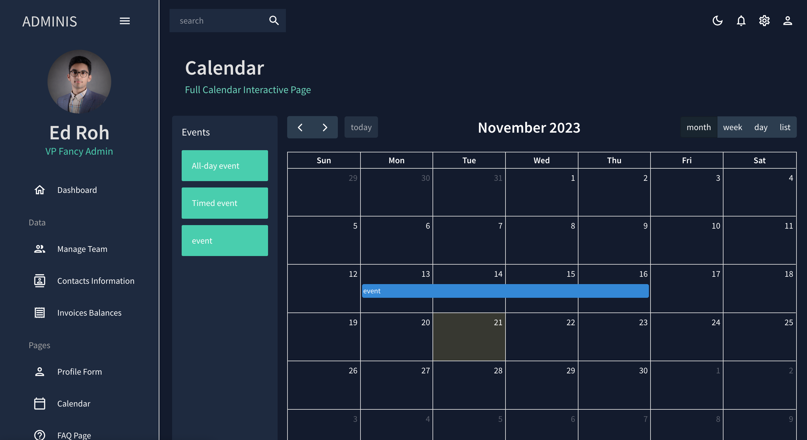

# React Admin Dashboard
This Repo Contains a Admin Dashboard WebSite Made Using Reactjs And Mui.

## Preview
[amirhayati.github.io/Admin-Dashbourd/](https://amirhayati.github.io/Admin-Dashbourd/)

## TechStack
- Reactjs
- React-Router-Dom
- Emotion
- Mui
- Nivo
- Formic
- Yup

## Features
- Full Admin Dashboard
- Manage Users
- Sort Users
- Contact Form
- Custom Calender
- Custom Bar Chart
- Custom Pie Chart
- Custom Line Chart
- Custom Geography Chart
- Dark And Light Theme

## How To Run
1. Clone This Repo.
1. Run `"npm install"` Command
1. Run `"npm start"` Command

## ScreenShot
Main Page

  
Contact Page

  
Calender Page

